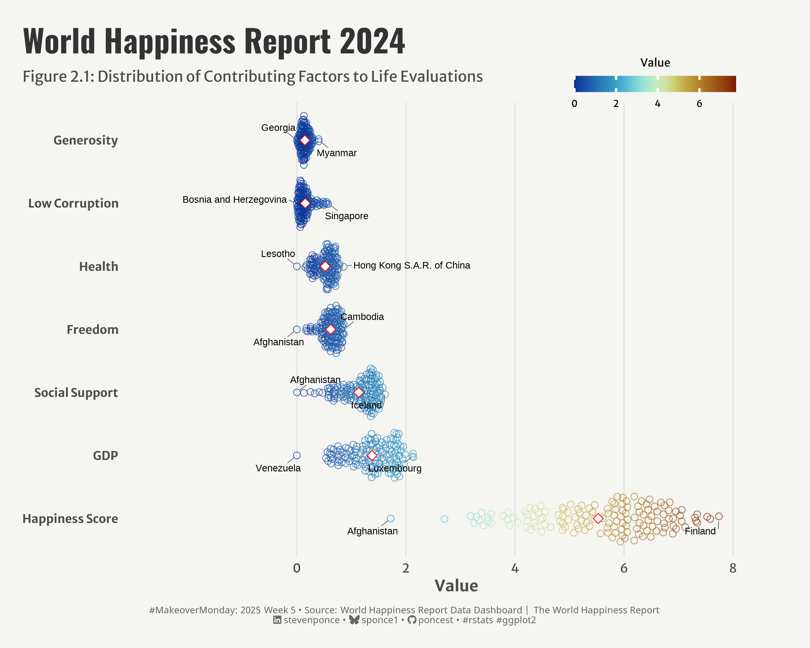
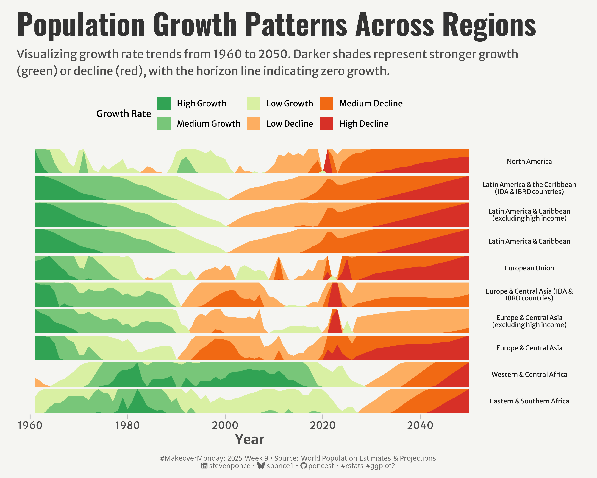
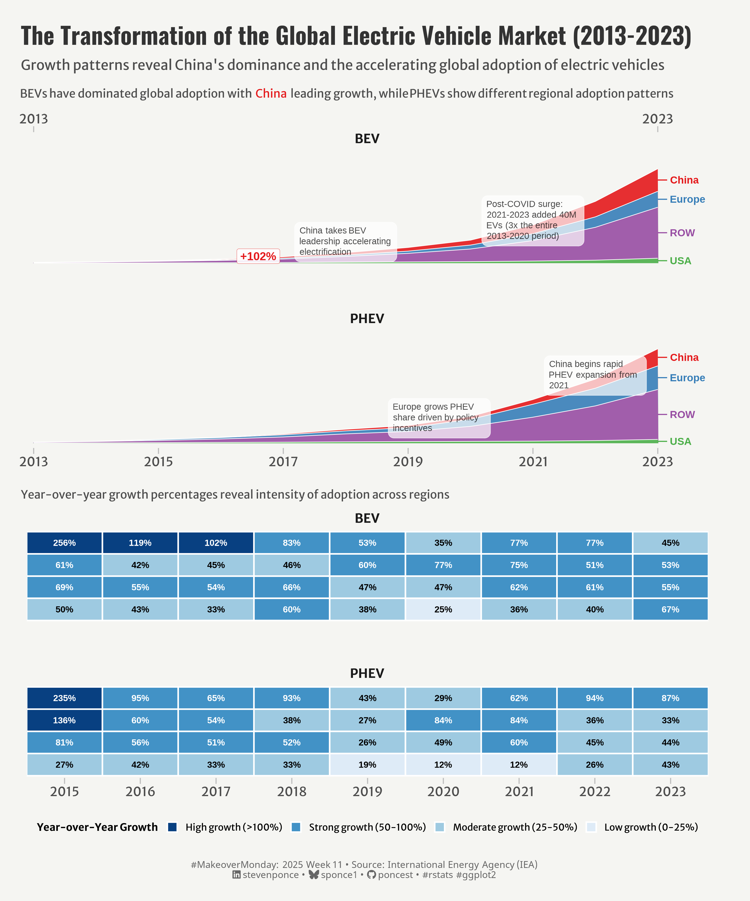
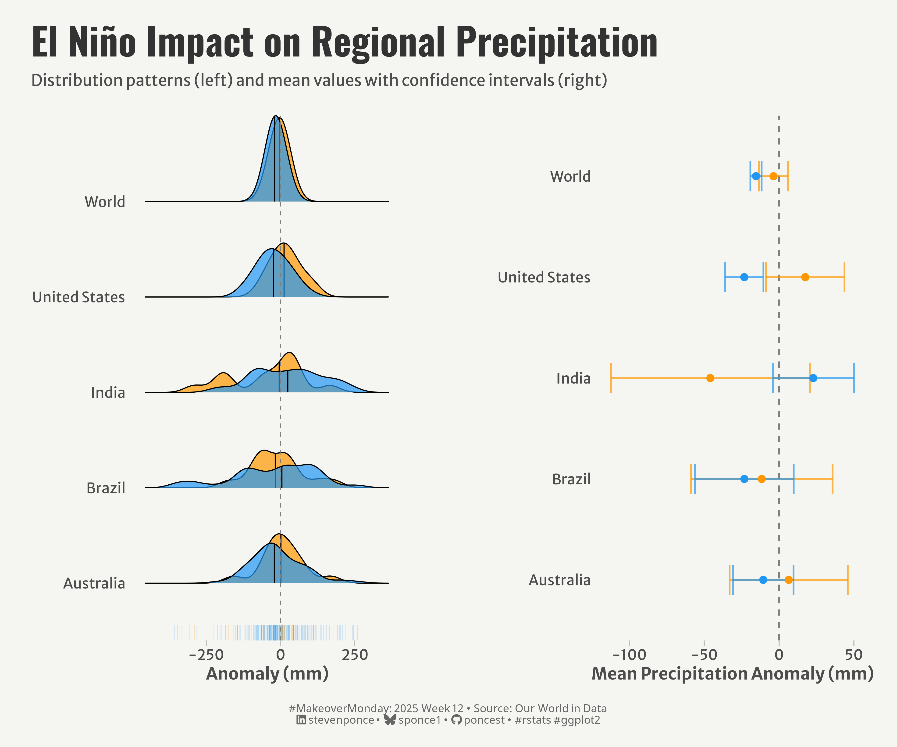
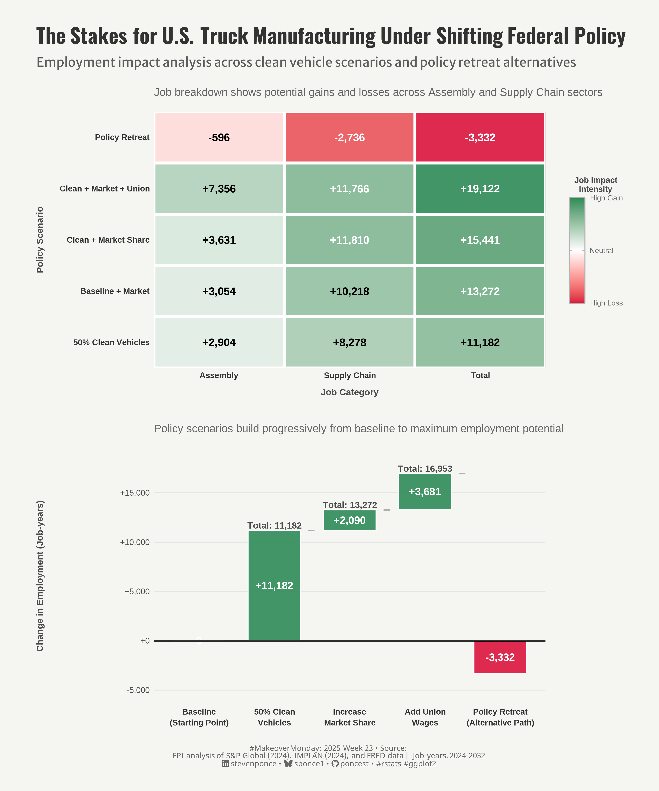
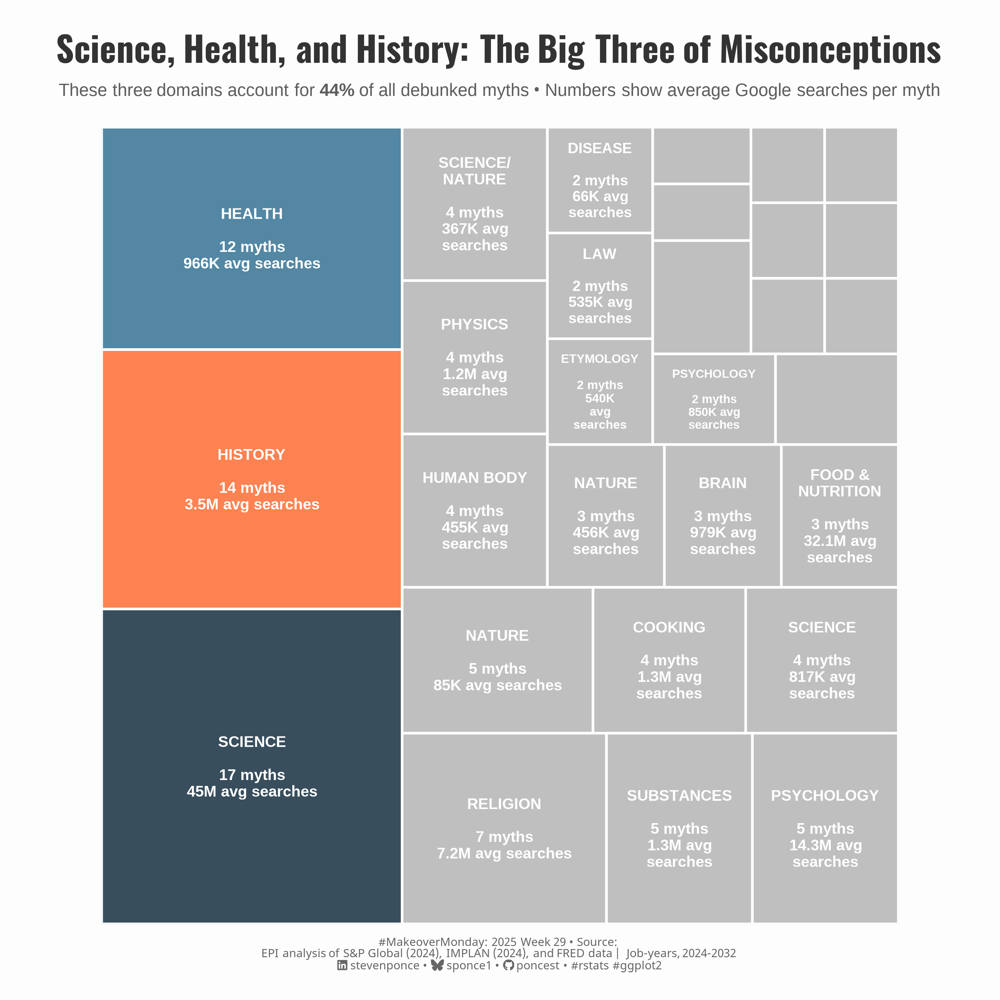

# #MakeoverMonday Challenge

| [Week 05 World Happiness Report 2024](https://github.com/poncest/MakeoverMonday/tree/master/2025/Week_05) | [Week 06 National Grid: Live](https://github.com/poncest/MakeoverMonday/tree/master/2025/Week_06) | [Week 07  Candystore.com](https://github.com/poncest/MakeoverMonday/tree/master/2025/Week_07) | [Week 08](https://github.com/poncest/MakeoverMonday/tree/master/2025/Week_08)[ ](https://github.com/poncest/MakeoverMonday/tree/master/2025/Week_07)[Per Second](https://github.com/poncest/MakeoverMonday/tree/master/2025/Week_08) |
|:----------------:|:----------------:|:----------------:|:----------------:|
|  |  |  |  |
| [Week 09 World Population Estimates & Projections](https://github.com/poncest/MakeoverMonday/tree/master/2025/Week_09) | [Week 10 River Water Quality](https://github.com/poncest/MakeoverMonday/tree/master/2025/Week_10) | [Week 11 Electric Car Sales](https://github.com/poncest/MakeoverMonday/tree/master/2025/Week_11) | [Week 12 Precipitation Anomalies](https://github.com/poncest/MakeoverMonday/tree/master/2025/Week_12) |
|  |  |  |  |
| [Week 13 Work Productivity](https://github.com/poncest/MakeoverMonday/tree/master/2025/Week_13) | [Week 18 Trump Approval Ratings](https://github.com/poncest/MakeoverMonday/tree/master/2025/Week_18) | [Week 19 Asian Restaurant in the US](https://github.com/poncest/MakeoverMonday/tree/master/2025/Week_19) | [Week 20 The Religious Composition of the World’s Migrants](https://github.com/poncest/MakeoverMonday/tree/master/2025/Week_20) |
|  |  |  |  |
| [Week 21 Metacritic Best Games of All Time](https://github.com/poncest/MakeoverMonday/tree/master/2025/Week_21) | [Week 23 What future will U.S. truck manufacturing have under Trump?](https://github.com/poncest/MakeoverMonday/tree/master/2025/Week_23) | [Week 28 Common MythConceptions](https://github.com/poncest/MakeoverMonday/tree/master/2025/Week_28) | [Week 29 Trump’s deportations](https://github.com/poncest/MakeoverMonday/tree/master/2025/Week_29) |
|  |  |  |  |
| [Week 30 London Underground Average Monthly Temperatures](https://github.com/poncest/MakeoverMonday/tree/master/2025/Week_30) | [Week 31 Low wages acr](https://github.com/poncest/MakeoverMonday/tree/master/2025/Week_31)[oss Europe](https://github.com/poncest/MakeoverMonday/tree/master/2025/Week_31) | [Week 32 Corruption](https://github.com/poncest/MakeoverMonday/tree/master/2025/Week_32) | [Week 33 Access to Electricity](https://github.com/poncest/MakeoverMonday/tree/master/2025/Week_33) |
|  |  |  |  |
| [Week 34 Unemployment Rate](https://github.com/poncest/MakeoverMonday/tree/master/2025/Week_34) | [Week 35 Meat Production by Livestock Type](https://github.com/poncest/MakeoverMonday/tree/master/2025/Week_35) | [Week 36 Drug Harms in the UK](https://github.com/poncest/MakeoverMonday/tree/master/2025/Week_36) | [Week 37 AI Impact on Job Market: (2024–2030)](https://github.com/poncest/MakeoverMonday/tree/master/2025/Week_37) |
|  |  |  |  |
| [Week 38 Which ‘kidult’ hobbies do Britons think are for children?](https://github.com/poncest/MakeoverMonday/tree/master/2025/Week_38) | [Week 39 Family spending in the UK](https://github.com/poncest/MakeoverMonday/tree/master/2025/Week_39) | [Week 40 Better things come to those who wait](https://github.com/poncest/MakeoverMonday/tree/master/2025/Week_40) | [Week 41 Drug Consumptions (UCI)](https://github.com/poncest/MakeoverMonday/tree/master/2025/Week_41) |
|  |  |  |  |
| [Week 42 Cultural Issues and the 2024 Election](https://github.com/poncest/MakeoverMonday/tree/master/2025/Week_42) | [Week 44 WWII Veteran Statistics](https://github.com/poncest/MakeoverMonday/tree/master/2025/Week_44) |  |  |
|  |  |  |  |
|  |  |  |  |
