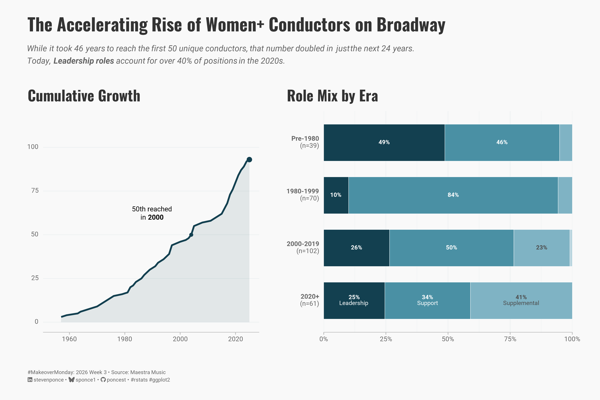
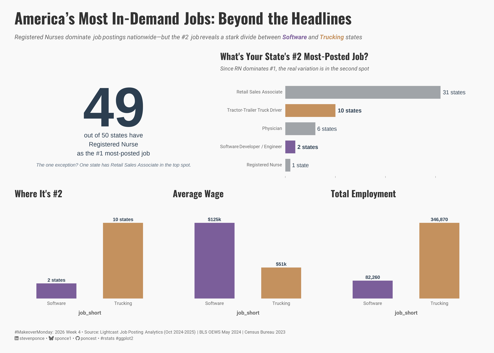
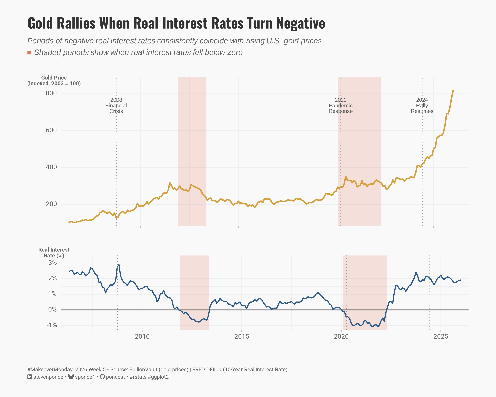
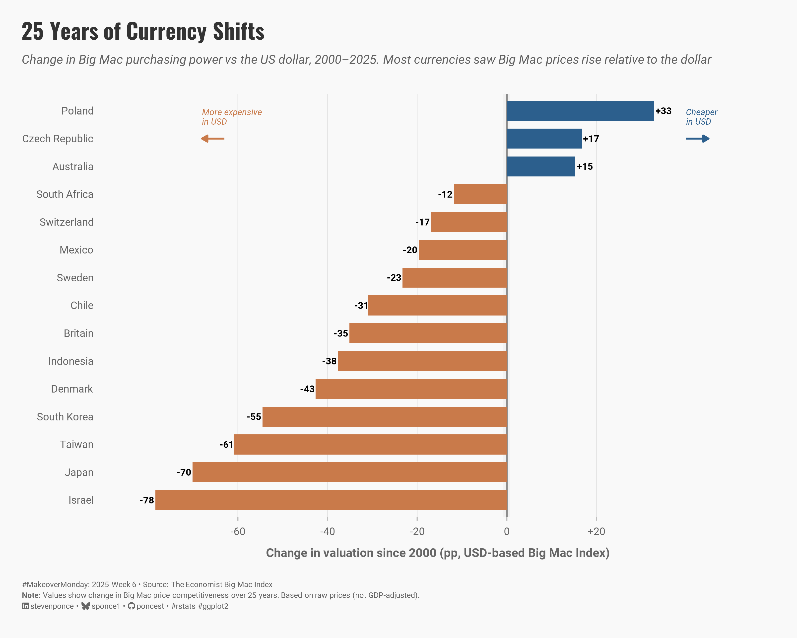
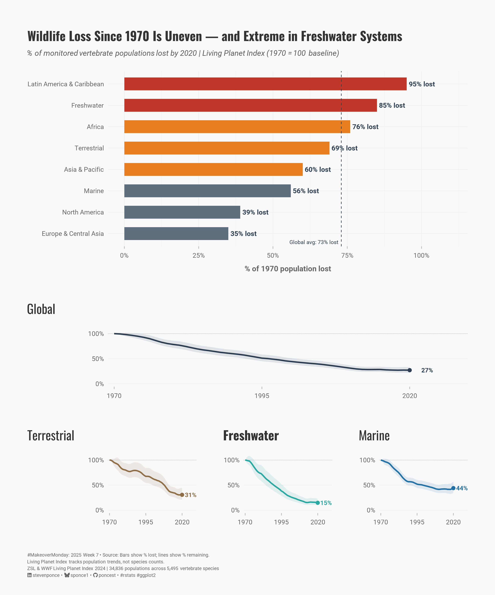
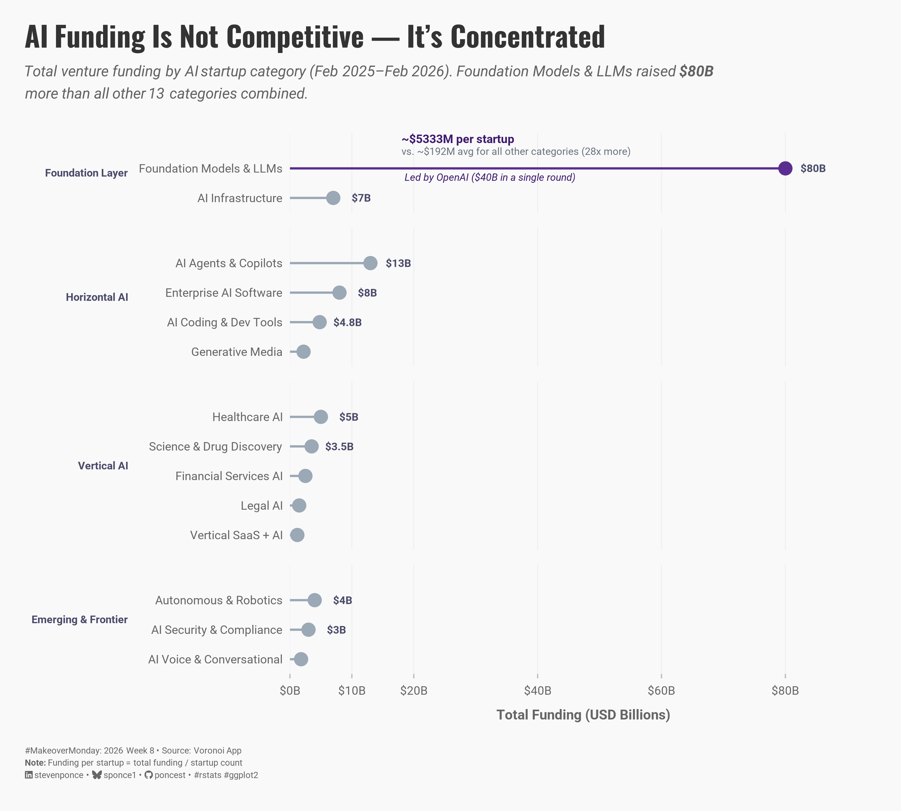

# 

| [Week 02 The Biggest Housing Bubble Risks Globally](https://github.com/poncest/MakeoverMonday/tree/master/2026/Week_02) | [Week 03 Women+ Conductors on Broadway](https://github.com/poncest/MakeoverMonday/tree/master/2026/Week_03) | [Week 04 Most Posted US Jobs by State](https://github.com/poncest/MakeoverMonday/tree/master/2026/Week_04) | [Week 05 gold Prices](https://github.com/poncest/MakeoverMonday/tree/master/2026/Week_05) |
|:----------------:|:----------------:|:----------------:|:----------------:|
|  |  |  |  |
| [Week 06 Global Big Mac Index](https://github.com/poncest/MakeoverMonday/tree/master/2026/Week_06) | [Week 07 Living Planet Index](https://github.com/poncest/MakeoverMonday/tree/master/2026/Week_07) | [Week 08 Periodic Table of AI](https://github.com/poncest/MakeoverMonday/tree/master/2026/Week_08) |  |
|  |  |  |  |
|  |  |  |  |
|  |  |  |  |
|  |  |  |  |
|  |  |  |  |
|  |  |  |  |
|  |  |  |  |
|  |  |  |  |
|  |  |  |  |
|  |  |  |  |
|  |  |  |  |
|  |  |  |  |
|  |  |  |  |
|  |  |  |  |
|  |  |  |  |
|  |  |  |  |
